# 侨福芳草地 · 营销效能战情室

> **Parkview Green Marketing ROI Command Center**
>
> 商业综合体优惠券营销 ROI 全链路分析平台 · Streamlit + Flask 双应用架构 · DeepSeek AI 业务诊断


---

## 一句话说清楚

商场每年投放数万张优惠券，运营只能看到"发出去多少张"，看不到"到底赚回来多少钱"。这个系统把发券记录和 POS 消费流水打通，自动计算每张券的 ROI，把顾客分成四类（薅羊毛的 / 高价值的 / 对券敏感的 / 路人），用 AI 写出诊断报告，告诉你该砍哪类券、该投哪类人。

---

## 截图

### 数据上传 & 战情摘要


侧边栏上传 CSV，系统自动对齐券表和销售表。支持按会员等级、年龄段、时间范围筛选，可保存场景书签一键切换。


首页指挥中心。顶部三级告警横幅（严重 / 预警 / 健康，红黄绿圆角胶囊），4 张核心 KPI 卡片（ROI、总销售额、核销转化率、会员贡献占比），每张卡片底部带 AI 分析注解。


双轴趋势图（发券量柱状图 + 销售额折线图）配券种结构环形图和业态销售额条形图，一页纵览全局。

### KPI 总览

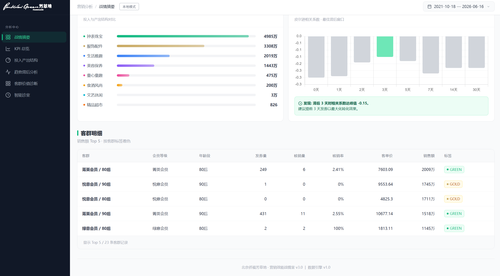

8 张 KPI 详情卡片，每张含数值、单位、同比/环比变化箭头、数据来源提示。模拟模式下展示原始值 vs 模拟值对比。


度量值字典表：列出每个指标的 Key、公式、当前值、单位、状态。运营人员可以清楚知道每个数字是怎么算出来的。

### 投入产出结构 & 趋势滞后分析

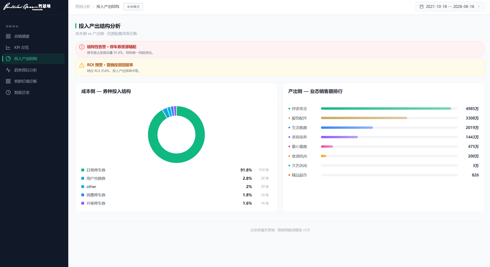

左侧券种环形图（成本侧）vs 右侧业态销售额条形图（产出侧），结构性失衡一目了然。

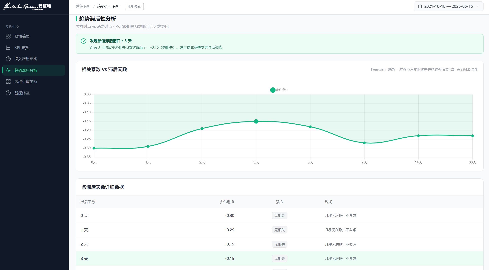

可调粒度（日/周/月）双轴时间序列，发券量、核销量、销售额三条曲线叠加展示。

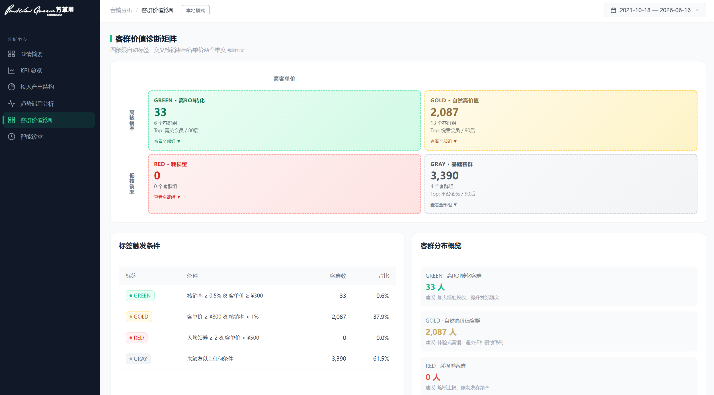

Pearson 相关系数在 0/1/2/3/5/7/14/30 天滞后窗口上自动计算，找出最优转化周期。IsolationForest 自动标记异常时间点。

### 客群价值诊断


四象限散点图，按规则自动着色：红（券效耗损型）、金（自然高价值型）、绿（高 ROI 转化型）、灰（常规基石型），每个象限附带建议动作。

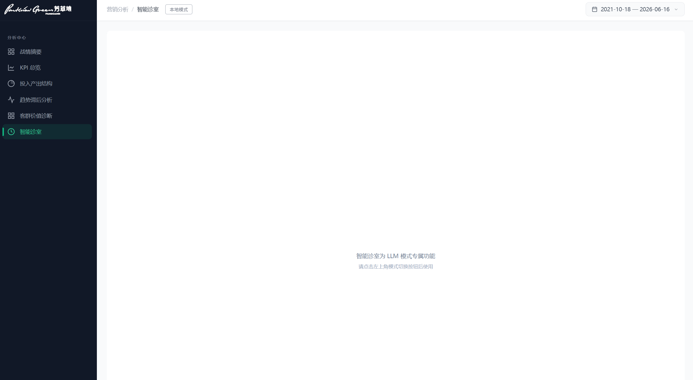

KMeans 自动聚类气泡图 + 客群详情表（人均领券、核销率、客单价、总销售额），支持按会员等级 × 年龄段交叉下钻。

### 智能诊室

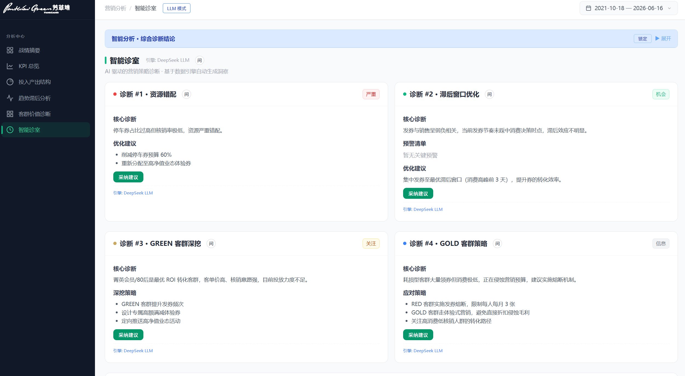

DeepSeek 大模型自动生成四类诊断卡片：严重告警、预警提示、信息摘要、优化建议。每条建议可一键加入模拟参数。

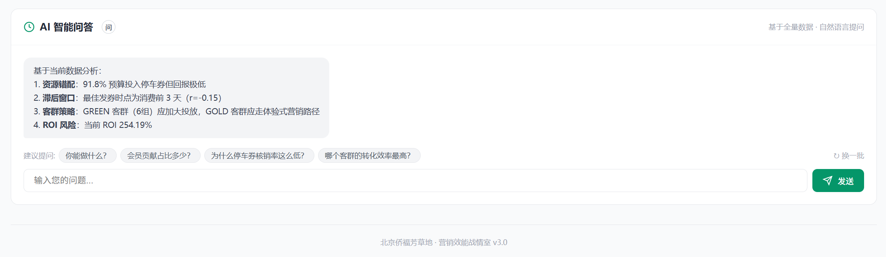

自由多轮追问，基于当前数据上下文实时回答。可以追问具体指标、某个客群、某项策略。

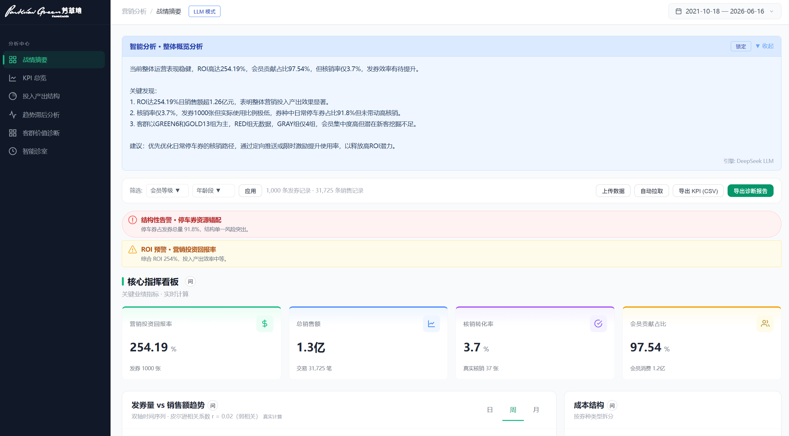

Agent 控制面板：手动触发巡检、一键导出 Markdown 诊断报告、发送告警邮件、查看操作历史。

### 模拟推演

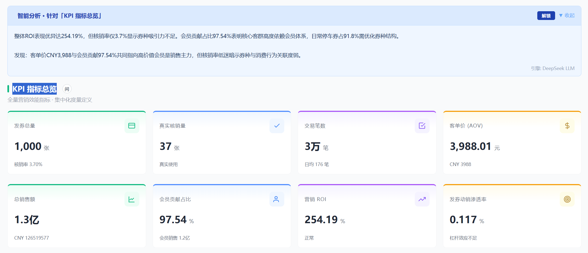

采纳 AI 建议后进入模拟状态。顶部横幅显示已应用的调整参数（可单独移除），KPI 卡片实时展示模拟值 vs 原始值。

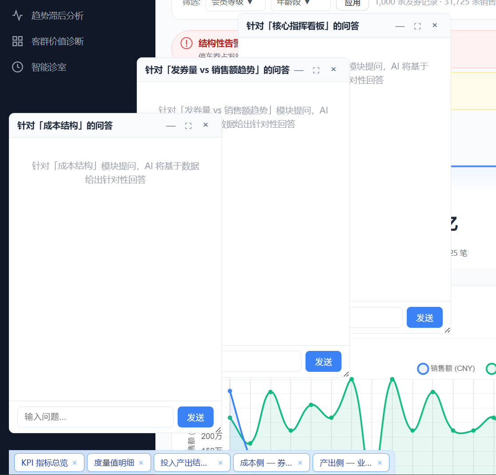

趋势图叠加原始曲线（虚线）与模拟曲线（实线），直观对比调整前后的时序变化。

### Flask Web 应用

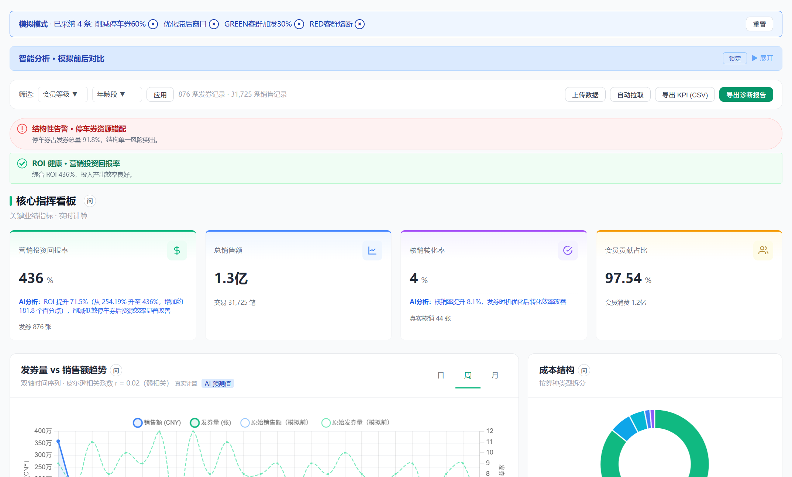

Flask + Chart.js + ECharts 单页 Web 应用（端口 8050），六个分析模块集成在可折叠滚动页面中，右侧 AI 聊天抽屉支持逐模块追问。

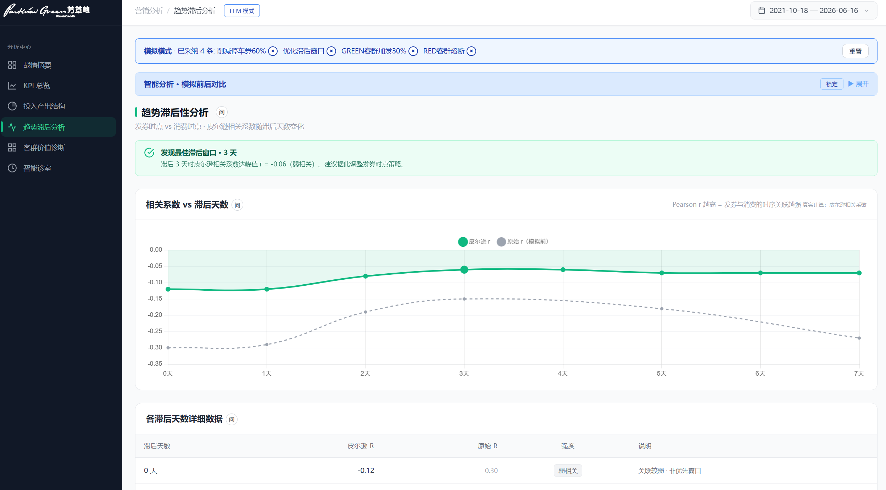

Web 应用中的三级告警图标体系（圆形 / 圆角三角 / 圆形对勾）与模拟模式交互。

---

## 系统架构

```
数据层：CSV 文件（发券记录 + POS 销售流水）
          │ schema_mapping.yaml 列名映射
          ▼
数据引擎：Pandas 加载清洗 · status_code 推导 · VIP 等级映射 · 年龄世代推算
          │
    ┌─────┴─────┐
    ▼           ▼
语义层         AI 引擎
9 KPI 统一     ├── DeepSeek 大模型（主力）
计算引擎       ├── 本地规则引擎（零依赖降级）
同比环比       ├── IsolationForest 异常检测
               └── KMeans 客群聚类 (k=4)
          │
    ┌─────┴─────┐
    ▼           ▼
Streamlit      Flask
(端口 8501)    (端口 8050)
6 页 BI 看板    REST API + SPA
```

**两个应用共享同一套数据、同一套 KPI 定义、同一个 AI 引擎。** Streamlit 适合分析师深度探索，Flask Web 应用适合嵌入内部系统或分享只读链接。

---

## 功能模块

| 模块 | 做什么 | 技术实现 |
|:---|:---|:---|
| **战情摘要** | 4 张 KPI 卡片 + 告警横幅 + 趋势图 + 结构图，一眼看清全局 | Streamlit + Plotly + 自定义玻璃态 CSS |
| **KPI 总览** | 8 张 KPI 详情卡 + 度量值字典表（含公式） | MetricEngine 统一计算 + ComparisonEngine 同比环比 |
| **投入产出结构** | 券种（成本）vs 业态销售额（产出）左右对比 | Plotly 环形图 + 横向条形图 |
| **趋势滞后分析** | 双轴时间序列 + 可调滞后窗口 + Pearson 相关 + 异常检测 | Plotly + scikit-learn IsolationForest |
| **客群价值诊断** | 四象限自动分类 + KMeans 聚类 + 交叉下钻 | YAML 规则引擎 + scikit-learn KMeans |
| **智能诊室** | AI 生成诊断报告 + 自由追问 + 模拟推演 + Agent 巡检 | DeepSeek API（OpenAI SDK）+ 本地规则降级 |
| **Agent 定时巡检** | 独立进程：加载数据 → 计算 KPI → 异常检测 → AI 诊断 → 邮件告警 → 导出报告 | schedule + smtplib |

---

## 业务模型

### 核心 KPI（9 个）

| KPI | 公式 | 说明 |
|:----|:-----|:-----|
| 营销 ROI | `(券拉动销售额 − 估算成本) / 估算成本 × 100` | 核心指标，营销投入的真实回报 |
| 核销转化率 | `真实核销量 / 发券总量 × 100` | 券 → 消费转化效率 |
| 总销售额 | `sum(销售额)` | 全量销售业绩 |
| 客单价 (AOV) | `总销售额 / 交易笔数` | 单笔交易价值 |
| 会员贡献占比 | `会员销售额 / 总销售额 × 100` | 会员体系贡献度 |
| 券销售渗透率 | `券拉动销售额 / 总销售额 × 100` | 营销对整体收入的杠杆效应 |
| 发券总量 | `count(发券记录)` | 投放规模 |
| 真实核销量 | `sum(status=1)` | 真正被使用的券数 |
| 整体核销率 | `总核销量 / 发券总量 × 100` | 综合核销效率 |

### 客群四象限

| 标签 | 判定条件 | 策略 |
|:-----|:---------|:-----|
| **RED** 券效耗损型 | 人均领券 ≥ 5 且 客单价 < ¥200 | 冻结发券，限 3 张/人/月 |
| **GOLD** 自然高价值型 | 客单价 ≥ ¥1,000 且 核销率 < 2% | 重服务留存，低券敏感度 |
| **GREEN** 高 ROI 转化型 | 核销率 ≥ 1% 且 客单价 ≥ ¥500 | 加大投入，提高券配额 |
| **GRAY** 常规基石型 | 无明显特征 | 标准运营节奏 |

### 告警规则（6 条）

| 条件 | 级别 | 含义 |
|:-----|:-----|:-----|
| ROI < 10% | 严重 | 营销投入产出严重失衡 |
| ROI < 30% | 预警 | 利润空间受压 |
| 停车券占比 > 70% | 严重 | 券种结构严重单一 |
| 核销率 < 1% | 预警 | 券激励力度不足 |
| 券渗透率 < 0.05% | 预警 | 营销杠杆效应过低 |
| 会员贡献 < 50% | 提示 | 会员运营存在缺口 |

---

## 本地模式 vs LLM 模式

系统默认以**本地模式**运行，不依赖任何外部 API。点击页面顶部按钮可切换到 **LLM 模式**（需配置 DeepSeek API Key）。

| | 本地模式 | LLM 模式 |
|:---|:---|:---|
| **KPI 计算** | 正常 | 正常 |
| **图表可视化** | 正常 | 正常 |
| **告警检测** | 正常 | 正常 |
| **异常检测 / 聚类** | 正常 | 正常 |
| **AI 诊断报告** | 本地规则引擎生成结构化文本 | DeepSeek 大模型生成自然语言分析 |
| **AI 追问** | 不可用（页面提示"LLM 模式专属功能"） | 可用，多轮对话 |
| **模拟推演** | 不可用 | 可用 |
| **数据隐私** | 零外部调用，数据不出内网 | 指标摘要发送到 DeepSeek API |
| **成本** | 免费 | ~¥0.002/次，~¥3/月 |

本地模式的存在是因为甲方数据安全部门通常不允许业务数据通过外部 API 传输。系统设计上保证：即使永远不开 LLM 模式，所有数据分析和可视化功能完整可用，仅 AI 叙事质量下降。

---

## 与 Power BI 的对比

| 维度 | Power BI / Tableau | 本系统 |
|:---|:---|:---|
| 上手门槛 | 需要学 DAX、拖拽建图 | 上传 CSV 即用 |
| 分析灵活性 | 极高，自由设计任意图表 | 固定 6 页模块，覆盖 90% 日常场景 |
| AI 能力 | 需额外购买 Copilot（$20/人/月） | 内置 DeepSeek，全团队 ~¥3/月 |
| 部署成本 | Power BI Pro $10/人/月 | 免费开源，Docker 自部署 |
| 数据隐私 | 数据上传云端 | 本地运行，数据不出内网 |
| 业务适配 | 通用 BI，不懂营销术语 | 内置客群分类、滞后分析等营销领域知识 |
| 维护 | 需要专人维护数据模型 | YAML 改规则，运营自己就能调 |

本系统定位为**营销 ROI 快速诊断入口**。日常巡检用本系统秒级出结论，深度自定义分析再用 Power BI。

---

## 快速启动

```bash
# 1. 安装依赖
pip install -r requirements.txt

# 2. 准备数据（放入 data/ 目录）
#    - BI_Dashboard_Ready_Data.csv  （发券记录）
#    - 销售查询.csv                 （POS 销售流水）
#    也可以在启动后通过侧边栏直接上传

# 3. 启动 Streamlit 看板
streamlit run app.py
# → http://localhost:8501

# 4. 启动 Flask Web 应用（可选）
pip install -r webapp/requirements.txt
python webapp/app.py
# → http://localhost:8050
```

**Docker 一键部署：**

```bash
docker compose up -d
# Streamlit → http://localhost:8501
# Flask     → http://localhost:8050
```

**启用 AI 洞察（可选）：** 在 [platform.deepseek.com](https://platform.deepseek.com) 获取 API Key，写入 `.streamlit/secrets.toml`：

```toml
DEEPSEEK_API_KEY = "sk-xxxxxxxx"
```

---

## 配置驱动

所有业务规则均为 YAML 文件，修改无需动代码：

| 文件 | 内容 | 例子：改什么 |
|:---|:---|:---|
| `config/metrics.yaml` | 9 个 KPI 的定义、公式、单位 | 改 ROI 计算公式 |
| `config/alerts.yaml` | 6 条告警规则、阈值、严重程度 | 把 ROI 告警线从 10% 调到 20% |
| `config/cohort_rules.yaml` | 4 象限客群分类条件 | 调整"高价值"客群的客单价门槛 |
| `config/schema_mapping.yaml` | CSV 列名 → 内部标准列名映射 | 接入另一个商场的数据源 |

---

## 项目结构

```
Parkview_Green_Marketing_ROI_Analysis_Dashboard/
├── app.py                    # Streamlit 入口
├── agent_scheduler.py        # 定时巡检脚本
├── Dockerfile                # Streamlit 容器
├── Dockerfile.webapp         # Flask 容器
├── docker-compose.yml        # 双服务编排
├── render.yaml               # Render.com 部署
├── requirements.txt
│
├── pages/                    # Streamlit 6 个页面
│   ├── 01_战情摘要.py
│   ├── 02_KPI总览.py
│   ├── 03_投入产出结构.py
│   ├── 04_趋势滞后分析.py
│   ├── 05_客群价值诊断.py
│   └── 06_智能诊室.py
│
├── config/                   # YAML 配置（所有业务规则）
│   ├── metrics.yaml          # KPI 定义
│   ├── alerts.yaml           # 告警规则
│   ├── cohort_rules.yaml     # 客群分类规则
│   ├── schema_mapping.yaml   # CSV 列名映射
│   ├── theme.py              # CSS 设计系统
│   └── mappings.py           # VIP/年龄映射
│
├── semantic_layer/           # 统一 KPI 计算
│   ├── metric_engine.py      # 9-KPI 引擎
│   └── comparison.py         # 同比环比引擎
│
├── ai_engine/                # AI & ML
│   ├── insight_generator.py  # DeepSeek + 本地规则降级
│   ├── anomaly_detector.py   # IsolationForest
│   ├── cohort_clustering.py  # KMeans (k=4)
│   └── agent_actions.py      # 邮件/报告/日志
│
├── data_engine/
│   └── data_loader.py        # Schema 驱动 CSV 加载
│
├── components/               # Streamlit 复用组件
│   ├── header.py             # 导航栏
│   ├── kpi_cards.py          # KPI 卡片
│   ├── filters.py            # 筛选器 + 书签
│   └── export_utils.py       # CSV/Excel 导出
│
├── webapp/                   # Flask Web 应用
│   ├── app.py                # 20+ REST API
│   ├── templates/index.html  # SPA 前端
│   ├── static/
│   │   ├── css/dashboard.css
│   │   └── js/dashboard.js   # 127KB 原生 JS
│   └── services/             # 业务逻辑层
│
├── tests/                    # 测试
├── screenshots/              # 产品截图 (17 张)
├── data/                     # CSV 数据文件
├── assets/                   # Logo 等静态资源
└── .github/workflows/ci.yml  # GitHub Actions CI
```

---

## CI / 测试

每次 Push 自动运行 GitHub Actions：

```yaml
# .github/workflows/ci.yml
1. pip install 依赖
2. python tests/run_tests.py          # 单元测试
3. python tests/test_five_fixes.py    # 回归测试
4. python tests/test_hover_analysis.py
5. python tests/test_lag_chart.py
6. python tests/test_scheduler.py
7. docker build Dockerfile            # 验证 Streamlit 镜像
8. docker build Dockerfile.webapp     # 验证 Flask 镜像
```

本地运行测试：

```bash
python tests/run_tests.py
```

---

## 技术栈

| 层 | 技术 |
|:---|:---|
| BI 框架 | Streamlit 1.32+ |
| Web 框架 | Flask 3.0+ |
| 可视化 | Plotly, Matplotlib, Chart.js, ECharts |
| 数据处理 | Pandas 2.0+, NumPy |
| 机器学习 | scikit-learn 1.3+ (IsolationForest, KMeans) |
| AI 大模型 | DeepSeek (OpenAI SDK) |
| 配置管理 | PyYAML |
| 定时任务 | schedule |
| 容器化 | Docker + Docker Compose |
| CI/CD | GitHub Actions |

---

## 已知局限

- 单机部署，百万级以上数据建议迁移至 Polars / DuckDB
- 固定 6 页分析模块，不支持像 Power BI 一样自由拖拽自定义图表
- DeepSeek 模式下 AI 洞察需网络连接；本地模式下降级为规则引擎
- 当前仅支持 CSV 文件，数据库直连需自行扩展

---

## License

MIT
